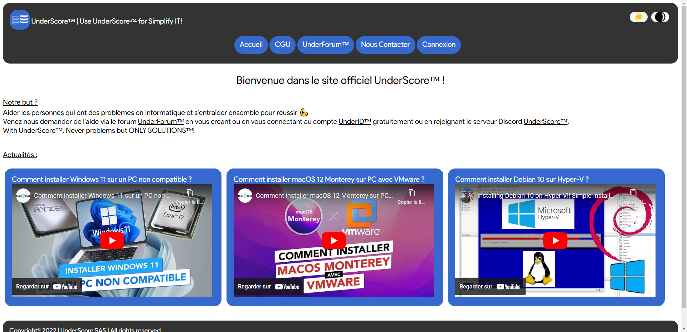
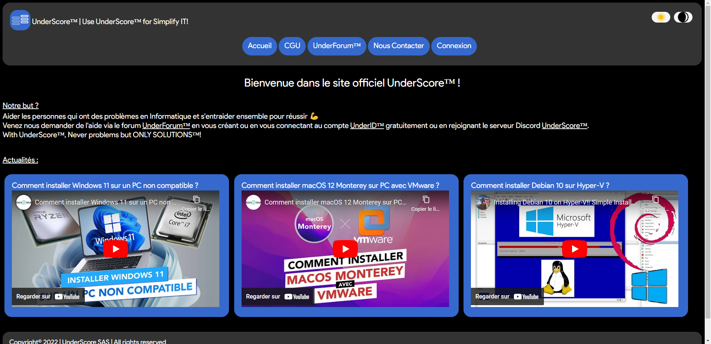
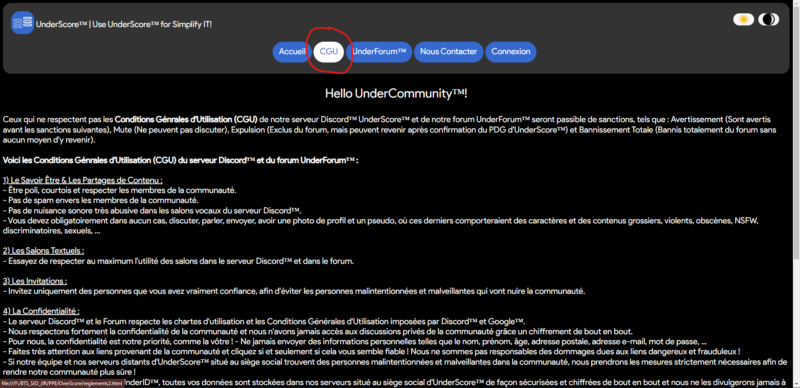
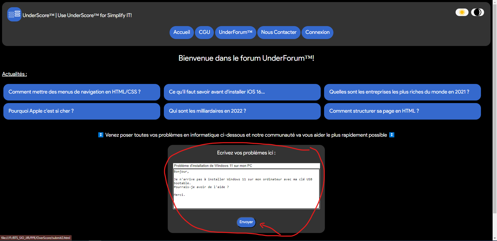
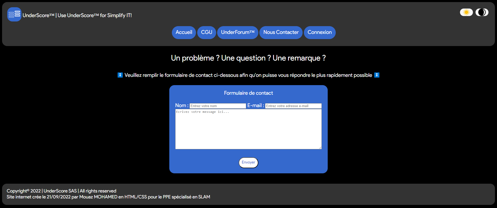
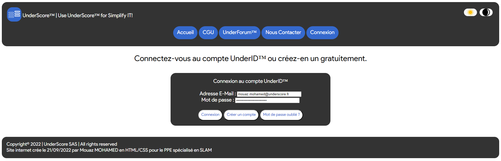
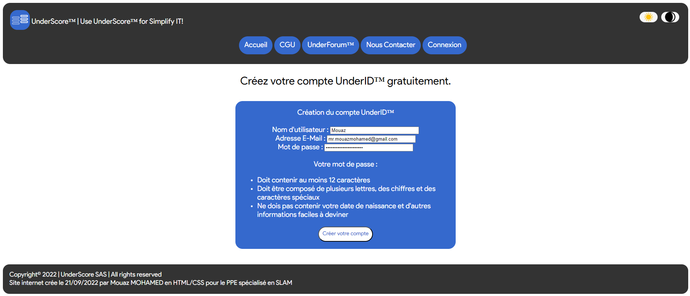
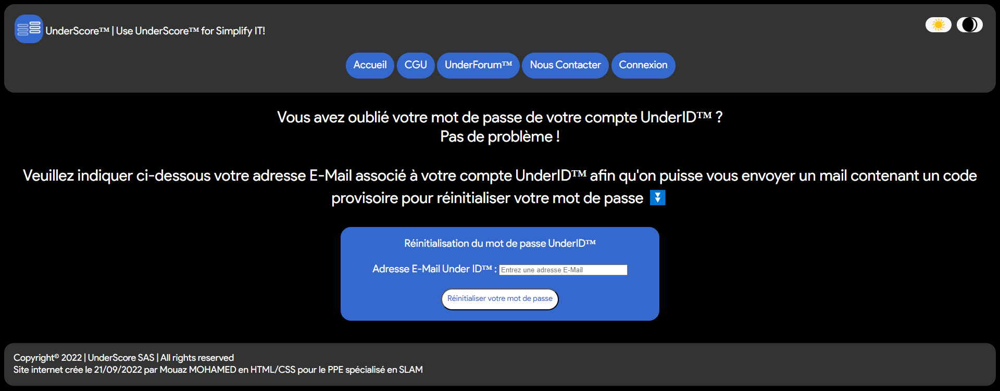

# Projet 1ère année de BTS - Site Web vitrine ~ Mouaz MOHAMED
Mon projet est un site Web vitrine développé en HTML et CSS dédié à l'entraide et à l'actualité en informatique.

---

## Accueil de mon site web
Voici l'accueil de mon site Web. 
 
Nous pouvons également le mettre en mode sombre, selon nos goûts. 
 
Nous pouvons y voir l'objectif/le but de mon site Web et les actualités, et nous pouvons se rendre dans les différents onglets grâce aux boutons.

---

## Conditions Générales d'Utilisation (CGU)
Voici les CGU de mon site Web (en mode sombre). 
 
Nous pouvons voir que lorsque je survole la souris dans les onglets du site, il y a un changement de couleur, donc une transition de 0,4s. Dans tout le site Web, il y a beaucoup de transition de couleur, que ce soit dans les onglets, les boutons, les champs de saisie, les listes, etc., en mode clair ou en mode sombre.

---

## Forum de mon site web
Voici le forum de mon site Web (en mode sombre). 
 
Également ici, lorsque je survole la souris dans le champ de saisie et dans le bouton Envoyer, il y a un changement de couleur. Cela est valable également dans les listes d'actualités.

---

## Formule de contact
Voici la formule de contact de mon site Web (en mode sombre). 

---

## Page de connexion
Voici la page de connexion de mon site Web (en mode clair). 

---

## Page de création de compte
Voici la page de création de compte de mon site Web (en mode clair) en cliquant sur <strong>Créer un compte</strong> dans la page de connexion. 

---

## Page d'oubli de mot de passe
Voici la page d'oubli de mot de passe d'un compte existant (en mode sombre) en cliquant sur <strong>Mot de passe oublié ?</strong> dans la page de connexion. 
